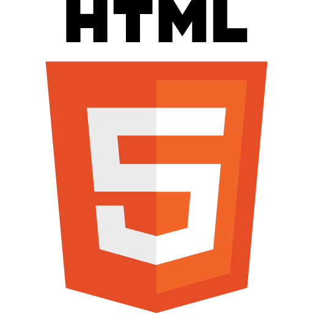

<h2 align="center">Hi 👋, I'm Tatyana</h2>
<h3 align="center">A front-end developer</h3>

- 🔭 I’m currently working at  https://ligaa.agency/
- 🌱 I’m currently learning React 
- 📫 How to reach me: [Twitter @tkyzmina](https://twitter.com/tkyzmina)

<!-- 👯 I’m looking to collaborate on ...
- 🤔 I’m looking for help with ...
- 💬 Ask me about ...
- 📫 How to reach me: 
- 😄 Pronouns: ...
- ⚡ Fun fact: ...
-->
#  Привет, меня зовут Татьяна.
## Я front-end разработчик из Санкт-Петербурга. 
## Люблю верстку и JS.
## В настоящий момент верстаю адаптивно в [Лига-А](https://ligaa.agency/)

### Languages and Frameworks

 
 
 