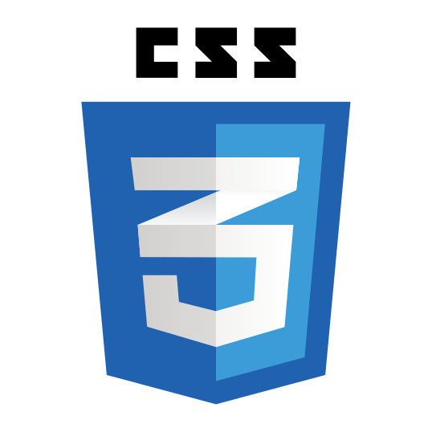

<h2 align="center">Hi 👋, I'm Tatyana</h2>
<h4 align="center">A front-end developer from Saint-Petersburg, Russia</h4>
<h3 align="center">I can make adaptive responsive websites with vanilla JavaScript. Using Flex-box, Grid and CSS animations.</h3>
<h3 align="center">I’m currently working as front-end developer at <a href="https://ligaa.agency/" target="_blank" rel="nofollow noopener noreferrer">Liga-A</a> and  open for new interesting projects.</h3>
<h3 align="center">I’m learning <a href="https://reactjs.org/" target="_blank" rel="nofollow noopener noreferrer">REACT JS</a>.</h3>
<h3 align="center">My native language is Russian but I also can fluently speak English.</h3>

<h3>Contacts:</h3>

  
 

### Languages and Frameworks

 
 
 